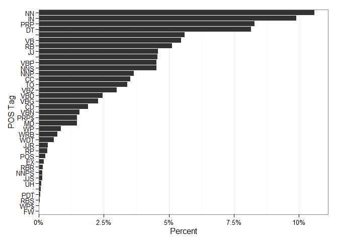
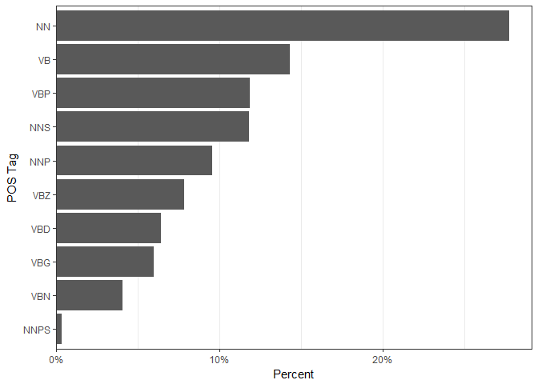
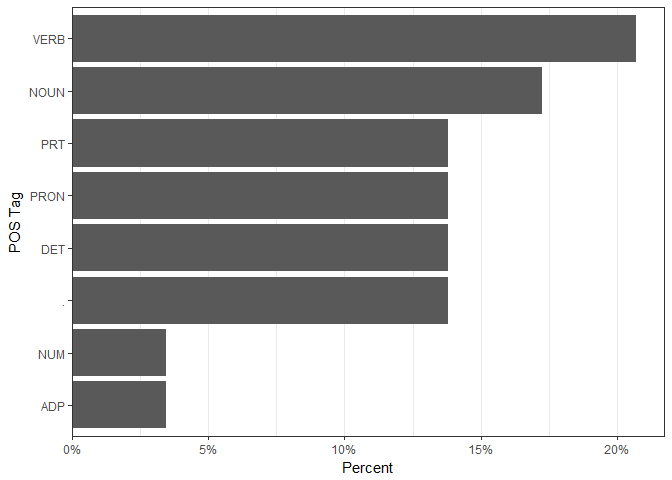
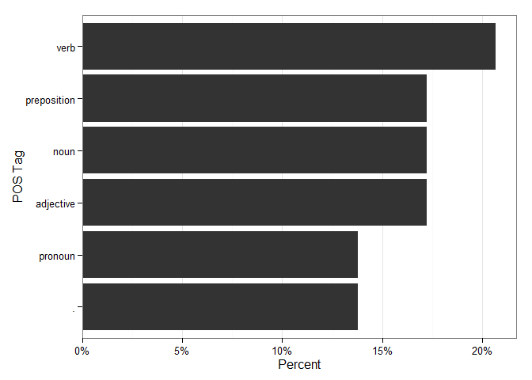

tagger
============

**tagger** wraps the **NLP** and **openNLP** packages for easier part of
speech tagging. **tagger** uses the **openNLP** annotator to compute
"Penn Treebank parse annotations using the Apache OpenNLP chunking
parser for English."

The main functions and descriptions are listed in the table below.

<table>
<thead>
<tr class="header">
<th align="left">Function</th>
<th align="left">Description</th>
</tr>
</thead>
<tbody>
<tr class="odd">
<td align="left"><code>tag_pos</code></td>
<td align="left">Tag parts of speech</td>
</tr>
<tr class="even">
<td align="left"><code>select_tags</code></td>
<td align="left">Select specific part of speech tags from <code>tag_pos</code></td>
</tr>
<tr class="odd">
<td align="left"><code>count_tags</code></td>
<td align="left">Cross tabs of tags by grouping variable</td>
</tr>
</tbody>
</table>

Table of Contents
============

-   [Installation](#installation)
-   [Contact](#contact)
-   [Examples](#examples)
    -   [Load the Tools/Data](#load-the-toolsdata)
    -   [Tagging](#tagging)
    -   [Plotting](#plotting)
    -   [Interpreting Tags](#interpreting-tags)
    -   [Counts](#counts)
    -   [Select Tags](#select-tags)
    -   [Altering Tag Display](#altering-tag-display)
        -   [As Word Tags](#as-word-tags)
        -   [As Tuples](#as-tuples)
        -   [As Universal Tags](#as-universal-tags)
        -   [As Basic Tags](#as-basic-tags)

Installation
============

To download the development version of **tagger**:

Download the [zip
ball](https://github.com/trinker/tagger/zipball/master) or [tar
ball](https://github.com/trinker/tagger/tarball/master), decompress and
run `R CMD INSTALL` on it, or use the **pacman** package to install the
development version:

    if (!require("pacman")) install.packages("pacman")
    pacman::p_load_gh("trinker/tagger")

Contact
=======

You are welcome to: 
* submit suggestions and bug-reports at: <https://github.com/trinker/tagger/issues> 
* send a pull request on: <https://github.com/trinker/tagger/> 
* compose a friendly e-mail to: <tyler.rinker@gmail.com>

Examples
========

The following examples demonstrate some of the functionality of
**tagger**.

Load the Tools/Data
-------------------

    library(dplyr); library(tagger)
    data(presidential_debates_2012)
    mwe <- data_frame(
        person = c("Tyler", "Norah", "Tyler"),
        talk = c(
            "I need $54 to go to the movies.",
            "They refuse to permit us to obtain the refuse permit",
            "This is the tagger package; like it?"
        )
    )

Tagging
-------

Let's begin with a minimal example.

    tag_pos(mwe$talk)

    ## [1] "I/PRP need/VBP $/$ 54/CD to/TO go/VB to/TO the/DT movies/NNS ./."                     
    ## [2] "They/PRP refuse/VBP to/TO permit/VB us/PRP to/TO obtain/VB the/DT refuse/NN permit/NN"
    ## [3] "This/DT is/VBZ the/DT tagger/NN package/NN ;/: like/IN it/PRP ?/."

Note that the out put pretty pints but the underlying structure is
simply a lst of named vectors, where the elements in the vectors are the
tokens and the names are the part of speech tags. We can use `c` on the
object to see it's true structure.

    tag_pos(mwe$talk) %>%
        c()

    ## [[1]]
    ##      PRP      VBP        $       CD       TO       VB       TO       DT 
    ##      "I"   "need"      "$"     "54"     "to"     "go"     "to"    "the" 
    ##      NNS        . 
    ## "movies"      "." 
    ## 
    ## [[2]]
    ##      PRP      VBP       TO       VB      PRP       TO       VB       DT 
    ##   "They" "refuse"     "to" "permit"     "us"     "to" "obtain"    "the" 
    ##       NN       NN 
    ## "refuse" "permit" 
    ## 
    ## [[3]]
    ##        DT       VBZ        DT        NN        NN         :        IN 
    ##    "This"      "is"     "the"  "tagger" "package"       ";"    "like" 
    ##       PRP         . 
    ##      "it"       "?"

Let's try it on a larger example, the built in
`presidential_debates_2012` data set. It'll take 30 seconds or so to
run, depending on the machine.

    tag_pos(presidential_debates_2012$dialogue)

    ## 1.    We/PRP 'll/MD talk/VB about/IN specifically/RB ...
    ## 2.    But/CC what/WP do/VBP you/PRP support/VB the/DT ...
    ## 3.    What/WP I/PRP support/VBP is/VBZ no/DT change/NN ...
    ## 4.    And/CC the/DT president/NN supports/VBZ taking/VBG ...
    ## 5.    And/CC what/WP about/IN the/DT vouchers/NNS ?/.
    ## .
    ## .
    ## .
    ## 2908. Thank/VB you/PRP so/RB much/RB ./.
    ## 2909. Gentlemen/NNS ,/, thank/VB you/PRP both/DT so/RB ...
    ## 2910. That/DT brings/VBZ an/DT end/NN to/TO this/DT ...
    ## 2911. As/IN I/PRP always/RB do/VBP at/IN the/DT end/NN ...
    ## 2912. Good/JJ night/NN ./.

This output is built into **tagger** as the
`presidential_debates_2012_pos` data set, which we'll use form this
point on in the demo.

Plotting
--------

The user can generate a horizontal barplot of the used tags.

    presidential_debates_2012_pos %>%
        plot()

Interpreting Tags
-----------------

The tags used by **openNLP** are utilize Penn Treebank. As such there
are many tags, more than the few parts of speech we learned in grade
school. Remember the meaning behind tags may be difficult, therefore the
`penn_tags` creates a left aligned data frame of the possible tags and
their meaning.

    penn_tags()

    ##    Tag  Description                                 
    ## 1  $    dollar                                      
    ## 2  ``   opening quotation mark                      
    ## 3  ''   closing quotation mark                      
    ## 4  (    opening parenthesis                         
    ## 5  )    closing parenthesis                         
    ## 6  ,    comma                                       
    ## 7  -    dash                                        
    ## 8  .    sentence terminator                         
    ## 9  :    colon or ellipsis                           
    ## 10 CC   conjunction, coordinating                   
    ## 11 CD   numeral, cardinal                           
    ## 12 DT   determiner                                  
    ## 13 EX   existential there                           
    ## 14 FW   foreign word                                
    ## 15 IN   preposition or conjunction, subordinating   
    ## 16 JJ   adjective or numeral, ordinal               
    ## 17 JJR  adjective, comparative                      
    ## 18 JJS  adjective, superlative                      
    ## 19 LS   list item marker                            
    ## 20 MD   modal auxiliary                             
    ## 21 NN   noun, common, singular or mass              
    ## 22 NNP  noun, proper, singular                      
    ## 23 NNPS noun, proper, plural                        
    ## 24 NNS  noun, common, plural                        
    ## 25 PDT  pre-determiner                              
    ## 26 POS  genitive marker                             
    ## 27 PRP  pronoun, personal                           
    ## 28 PRP$ pronoun, possessive                         
    ## 29 RB   adverb                                      
    ## 30 RBR  adverb, comparative                         
    ## 31 RBS  adverb, superlative                         
    ## 32 RP   particle                                    
    ## 33 SYM  symbol                                      
    ## 34 TO   "to" as preposition or infinitive marker    
    ## 35 UH   interjection                                
    ## 36 VB   verb, base form                             
    ## 37 VBD  verb, past tense                            
    ## 38 VBG  verb, present participle or gerund          
    ## 39 VBN  verb, past participle                       
    ## 40 VBP  verb, present tense, not 3rd person singular
    ## 41 VBZ  verb, present tense, 3rd person singular    
    ## 42 WDT  WH-determiner                               
    ## 43 WP   WH-pronoun                                  
    ## 44 WP$  WH-pronoun, possessive                      
    ## 45 WRB  Wh-adverb

Counts
------

The user can generate a count of the tags by grouping variable as well.
The number of columns explodes quickly, even with this minimal example.

    tag_pos(mwe$talk) %>%
        count_tags(mwe$person) 

    ##   person n.tokens       $        .       :      CD       DT      IN
    ## 1  Norah       10       0        0       0       0 1(10.0%)       0
    ## 2  Tyler       19 1(5.3%) 2(10.5%) 1(5.3%) 1(5.3%) 3(15.8%) 1(5.3%)
    ##         NN     NNS      PRP       TO       VB      VBP     VBZ
    ## 1 2(20.0%)       0 2(20.0%) 2(20.0%) 2(20.0%) 1(10.0%)       0
    ## 2 2(10.5%) 1(5.3%) 2(10.5%) 2(10.5%)  1(5.3%)  1(5.3%) 1(5.3%)

The default is a pretty printing (counts + proportions) that can be
turned off to print raw counts only.

    tag_pos(mwe$talk) %>%
        count_tags(mwe$person) %>%
        print(pretty = FALSE)

    ##    person n.tokens $ . : CD DT IN NN NNS PRP TO VB VBP VBZ
    ## 1:  Tyler       19 1 2 1  1  3  1  2   1   2  2  1   1   1
    ## 2:  Norah       10 0 0 0  0  1  0  2   0   2  2  2   1   0

Select Tags
-----------

The user may wish to select specific tags. The `select_tags` function
enables selection of specific tags via element matching (which can be
negated) or regular expression.

Here we select only the nouns.

    presidential_debates_2012_pos %>%
        select_tags(c("NN", "NNP", "NNPS", "NNS"))

    ## 1.    health/NN care/NN moment/NN
    ## 2.    voucher/NN system/NN Governor/NNP
    ## 3.    change/NN retirees/NNS retirees/NNS Medicare/NNP
    ## 4.    president/NN dollar/NN program/NN
    ## 5.    vouchers/NNS
    ## .
    ## .
    ## .
    ## 2908. 
    ## 2909. Gentlemen/NNS
    ## 2910. end/NN year/NN debates/NNS Lynn/NNP University/NNP ...
    ## 2911. end/NN debates/NNS words/NNS mom/NN vote/NN
    ## 2912. night/NN

This could also have been accomplished with a simpler regex call by
setting `regex = TRUE`.

    presidential_debates_2012_pos %>%
        select_tags("NN", regex=TRUE)

    ## 1.    health/NN care/NN moment/NN
    ## 2.    voucher/NN system/NN Governor/NNP
    ## 3.    change/NN retirees/NNS retirees/NNS Medicare/NNP
    ## 4.    president/NN dollar/NN program/NN
    ## 5.    vouchers/NNS
    ## .
    ## .
    ## .
    ## 2908. 
    ## 2909. Gentlemen/NNS
    ## 2910. end/NN year/NN debates/NNS Lynn/NNP University/NNP ...
    ## 2911. end/NN debates/NNS words/NNS mom/NN vote/NN
    ## 2912. night/NN

In this way we could quickly select the nouns and verbs with the
following call.

    presidential_debates_2012_pos %>%
        select_tags("^(VB|NN)", regex=TRUE)

    ## 1.    talk/VB health/NN care/NN moment/NN
    ## 2.    do/VBP support/VB voucher/NN system/NN Governor/NNP
    ## 3.    support/VBP is/VBZ change/NN retirees/NNS ...
    ## 4.    president/NN supports/VBZ taking/VBG dollar/NN ...
    ## 5.    vouchers/NNS
    ## .
    ## .
    ## .
    ## 2908. Thank/VB
    ## 2909. Gentlemen/NNS thank/VB
    ## 2910. brings/VBZ end/NN year/NN debates/NNS want/VBP ...
    ## 2911. do/VBP end/NN debates/NNS leave/VBP words/NNS ...
    ## 2912. night/NN

Note that the output is a `tag_pos` class and the plotting,
`count_tags`, and `as_word_tag` functions can be used on the result.

    presidential_debates_2012_pos %>%
        select_tags("^(VB|NN)", regex=TRUE) %>%
        plot()

    presidential_debates_2012_pos %>%
        select_tags("^(VB|NN)", regex=TRUE) %>%
        count_tags()

    ## Source: local data frame [2,912 x 11]
    ## 
    ##    n.tokens        NN      NNP  NNPS       NNS       VB   VBD      VBG
    ##       (dbl)     (chr)    (chr) (chr)     (chr)    (chr) (chr)    (chr)
    ## 1         4  3(75.0%)        0     0         0 1(25.0%)     0        0
    ## 2         5  2(40.0%) 1(20.0%)     0         0 1(20.0%)     0        0
    ## 3         6  1(16.7%) 1(16.7%)     0  2(33.3%)        0     0        0
    ## 4         5  3(60.0%)        0     0         0        0     0 1(20.0%)
    ## 5         1         0        0     0 1(100.0%)        0     0        0
    ## 6         3  1(33.3%)        0     0         0        0     0        0
    ## 7        16  4(25.0%) 2(12.5%)     0   1(6.2%) 4(25.0%)     0  1(6.2%)
    ## 8         1 1(100.0%)        0     0         0        0     0        0
    ## 9         6  1(16.7%)        0     0  1(16.7%) 3(50.0%)     0        0
    ## 10        5  2(40.0%)        0     0         0 2(40.0%)     0        0
    ## ..      ...       ...      ...   ...       ...      ...   ...      ...
    ## Variables not shown: VBN (chr), VBP (chr), VBZ (chr)

Altering Tag Display
--------------------

### As Word Tags

The traditional way to display tags is to incorporate them into the
sentence, placing them before their respective token, separated by a
forward slash (e.g., *VB/talk*). This is the default printing style of
`tag_pos` though not truly the structure of the output. The user can
coerce the underlying structure with the `as_word_tag` function,
converting the named list of vectors into a list of part of speech
incorporated, unnamed vectors. Below I only print the first 6 elements
of `as_word_tag`.

    presidential_debates_2012_pos %>%
        as_word_tag() %>%
        head()

    ## [1] "We/PRP 'll/MD talk/VB about/IN specifically/RB about/IN health/NN care/NN in/IN a/DT moment/NN ./."                                        
    ## [2] "But/CC what/WP do/VBP you/PRP support/VB the/DT voucher/NN system/NN ,/, Governor/NNP ?/."                                                 
    ## [3] "What/WP I/PRP support/VBP is/VBZ no/DT change/NN for/IN current/JJ retirees/NNS and/CC near/IN retirees/NNS to/TO Medicare/NNP ./."        
    ## [4] "And/CC the/DT president/NN supports/VBZ taking/VBG dollar/NN seven/CD hundred/CD sixteen/CD billion/CD out/IN of/IN that/DT program/NN ./."
    ## [5] "And/CC what/WP about/IN the/DT vouchers/NNS ?/."                                                                                           
    ## [6] "So/IN that/DT 's/VBZ that/DT 's/VBZ number/NN one/CD ./."

### As Tuples

**Python** uses a tuple construction of parts of speech to display tags.
This can be a useful structure. Essentially the structure is a lists of
lists of two element vectors. Each vector contains a word and a part of
speech tag. `as_tuple` uses the following **R** structuring:

    list(list(c("word", "tag"), c("word", "tag")), list(c("word", "tag")))

but prints to the console in the **Python** way. Using
`print(as_tuple(x), truncate=Inf, file="out.txt")` allows the user to
print to an external file.

    tag_pos(mwe$talk) %>%
        as_tuple() %>%
        print(truncate=Inf)

    ## [[("I", "PRP"), ("need", "VBP"), ("$", "$"), ("54", "CD"), ("to", "TO"), ("go", "VB"), ("to", "TO"), ("the", "DT"), ("movies", "NNS"), (".", ".")], [("They", "PRP"), ("refuse", "VBP"), ("to", "TO"), ("permit", "VB"), ("us", "PRP"), ("to", "TO"), ("obtain", "VB"), ("the", "DT"), ("refuse", "NN"), ("permit", "NN")], [("This", "DT"), ("is", "VBZ"), ("the", "DT"), ("tagger", "NN"), ("package", "NN"), (";", ":"), ("like", "IN"), ("it", "PRP"), ("?", ".")]]

### As Universal Tags

[Petrov, Das, & McDonald
(2011)](https://github.com/slavpetrov/universal-pos-tags) provide a
mapping to convert Penn Treebank tags into universal part of speech
tags. The `as_universal` function harnesses this mapping.

    tag_pos(mwe$talk) %>%
        as_universal()

    ## [1] "I/PRON need/VERB $/. 54/NUM to/PRT go/VERB to/PRT the/DET movies/NOUN ./."                          
    ## [2] "They/PRON refuse/VERB to/PRT permit/VERB us/PRON to/PRT obtain/VERB the/DET refuse/NOUN permit/NOUN"
    ## [3] "This/DET is/VERB the/DET tagger/NOUN package/NOUN ;/. like/ADP it/PRON ?/."

The out put is a `tag_pos` object and thus has a generic plot method.

    tag_pos(mwe$talk) %>%
        as_universal() %>%
        plot()

    tag_pos(mwe$talk) %>%
        as_universal() %>%
        count_tags()

    ##   n.tokens        .      ADP      DET     NOUN      NUM     PRON      PRT
    ## 1       10 2(20.0%)        0 1(10.0%) 1(10.0%) 1(10.0%) 1(10.0%) 2(20.0%)
    ## 2       10        0        0 1(10.0%) 2(20.0%)        0 2(20.0%) 2(20.0%)
    ## 3        9 2(22.2%) 1(11.1%) 2(22.2%) 2(22.2%)        0 1(11.1%)        0
    ##       VERB
    ## 1 2(20.0%)
    ## 2 3(30.0%)
    ## 3 1(11.1%)

### As Basic Tags

`as_basic` provides an even more coarse tagset than `as_universal`.
Basic tags include: (a) `nouns`, (b) `adjectives`, (c) `prepositions`,
(d) `articles`, (e) `verb`, (f) `pronoun`s, (g) `adverbs`, (h)
`interjections`, & (i) `conjunctions`. The `X` and `.` tags are retained
for punctuation and unclassified parts of speech. This tagset can be
useful for more coarse purposes, including formality (Heylighen &
Dewaele, 2002) scoring.

-   Heylighen, F., & Dewaele, J.M. (2002). Variation in the
    contextuality of language: An empirical measure. Context in Context,
    Special issue of Foundations of Science, 7 (3), 293-340.

<!-- -->

    tag_pos(mwe$talk) %>%
        as_basic()

    ## [1] "I/pronoun need/verb $/. 54/adjective to/preposition go/verb to/preposition the/adjective movies/noun ./."                       
    ## [2] "They/pronoun refuse/verb to/preposition permit/verb us/pronoun to/preposition obtain/verb the/adjective refuse/noun permit/noun"
    ## [3] "This/adjective is/verb the/adjective tagger/noun package/noun ;/. like/preposition it/pronoun ?/."

The out put is a `tag_pos` object and thus has a generic plot method.

    tag_pos(mwe$talk) %>%
        as_basic() %>%
        plot()

    tag_pos(mwe$talk) %>%
        as_basic() %>%
        count_tags()

    ##   n.tokens        . adjective     noun preposition  pronoun     verb
    ## 1       10 2(20.0%)  2(20.0%) 1(10.0%)    2(20.0%) 1(10.0%) 2(20.0%)
    ## 2       10        0  1(10.0%) 2(20.0%)    2(20.0%) 2(20.0%) 3(30.0%)
    ## 3        9 2(22.2%)  2(22.2%) 2(22.2%)    1(11.1%) 1(11.1%) 1(11.1%)